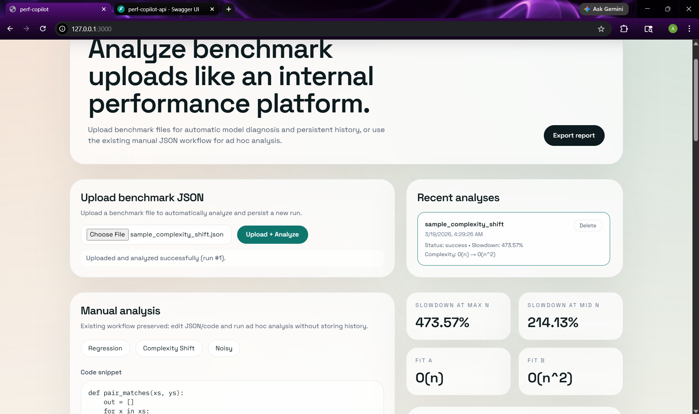
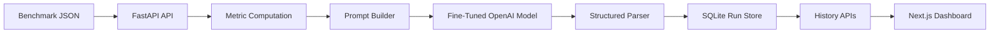
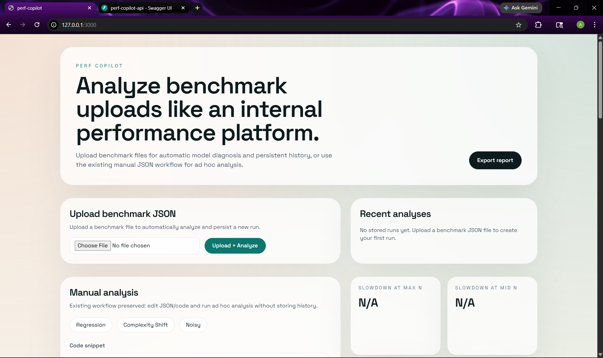
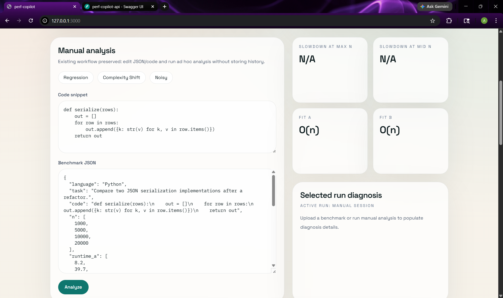
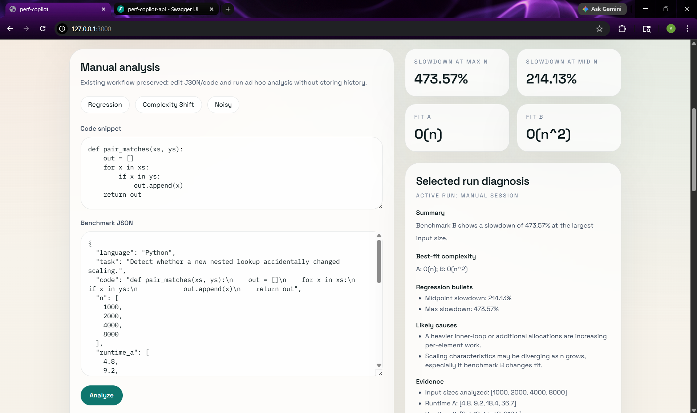
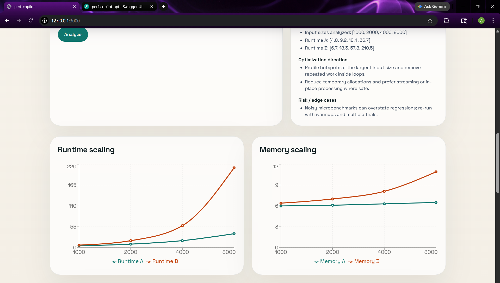
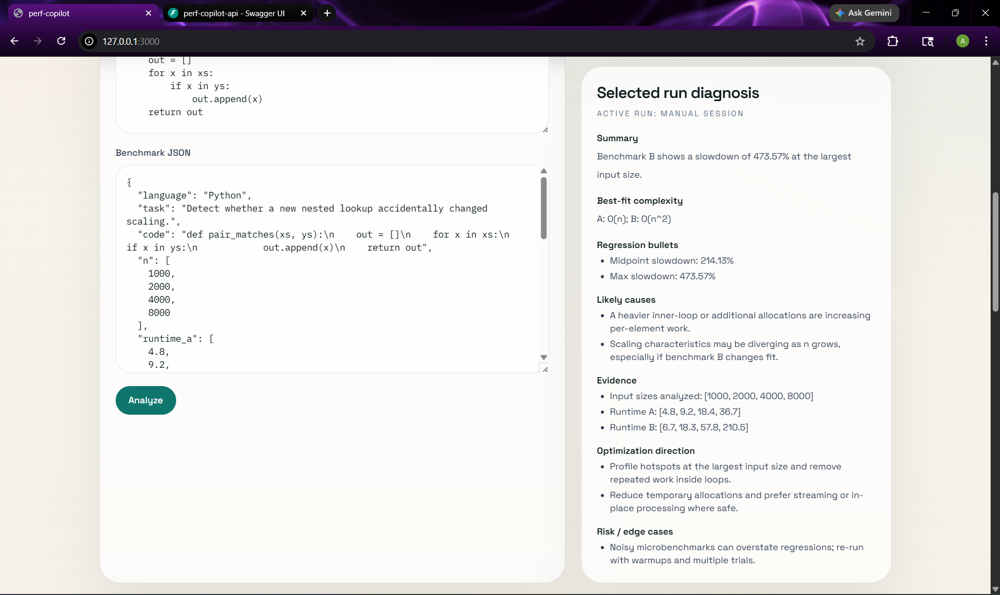
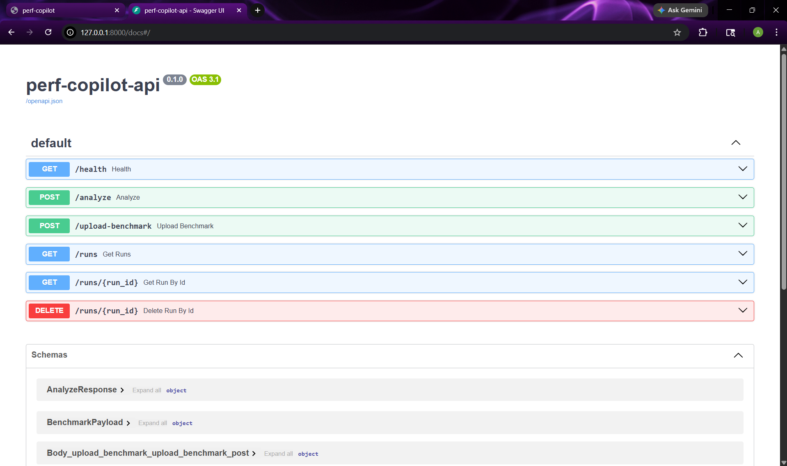

# PerfCopilot - AI-Powered Code Performance Regression Analyzer

AI-powered developer tooling for benchmark ingestion, regression detection, performance diagnosis, and historical analysis review.

PerfCopilot is a full-stack developer tool for analyzing benchmark regressions across code versions, quantifying slowdown and memory growth, and using a fine-tuned LLM to generate structured performance diagnoses and optimization guidance.

## Overview

PerfCopilot is designed to feel closer to an internal engineering tool than a one-off demo. A user can upload benchmark JSON, persist runs, inspect historical analyses, visualize scaling curves, and review an LLM-generated diagnosis that distinguishes likely constant-factor regressions from potential complexity-class regressions.



The project combines:

- benchmark ingestion and validation
- runtime and memory regression analysis
- persistent run storage with SQLite
- a FastAPI backend
- a Next.js dashboard
- historical run review
- a fine-tuned OpenAI model for structured diagnosis generation

## Problem

Performance regressions are often hard to diagnose from raw benchmark numbers alone. Engineers need more than a chart:

- how large is the slowdown at realistic input sizes?
- is the issue likely a constant-factor regression or a scaling shift?
- what evidence supports that interpretation?
- what optimizations are worth investigating first?

Most lightweight tooling stops at metrics. PerfCopilot adds a structured analysis layer on top of those metrics.

## Solution

PerfCopilot validates benchmark payloads, computes regression statistics, constructs a performance-analysis prompt, calls a fine-tuned LLM, parses the response into structured sections, stores the result, and exposes the full workflow in a dashboard with upload, history, and charting support.



## Key Features

- Upload benchmark JSON and automatically analyze it with the fine-tuned model
- Keep the original manual paste-and-analyze workflow for ad hoc inspection
- Compute slowdown at midpoint and max input sizes
- Track runtime and memory growth across versions
- Surface fit metadata to reason about likely scaling changes
- Persist analyses and revisit them from a history panel
- Export analysis reports from the dashboard
- Run CI checks for backend tests and frontend build/lint
- Post pull request benchmark summaries via GitHub Actions

## Architecture

### Backend

- `backend/app/api`: HTTP routes
- `backend/app/analysis`: benchmark metrics, prompt building, model invocation, parser
- `backend/app/services`: persisted run workflow
- `backend/app/db`: SQLAlchemy session + models
- `backend/app/schemas`: request/response contracts
- `backend/app/core`: config and auth dependencies

### Frontend

- `frontend/src/app`: Next.js app entry
- `frontend/src/components`: dashboard UI
- `frontend/src/lib`: API types and sample inputs

### Storage

- SQLite for persisted run history
- SQLAlchemy ORM for a simple, local-first data layer

More detail: [docs/architecture.md](/c:/Users/ANISH%20PC/Desktop/performance-analyzer/docs/architecture.md)

## Tech Stack

- Backend: Python 3.11, FastAPI, Pydantic, SQLAlchemy, HTTPX, Uvicorn
- Frontend: Next.js 14, React, TypeScript, Tailwind CSS, Recharts
- Storage: SQLite
- Tooling: Ruff, Black, Pytest, ESLint, Prettier
- CI: GitHub Actions
- Model integration: OpenAI Chat Completions with a fine-tuned model ID from env vars

## Repository Structure

```text
PerfCopilot/
  backend/
    app/
      analysis/
      api/
      core/
      db/
      schemas/
      services/
    tests/
    requirements.txt
    pyproject.toml
  frontend/
    src/
      app/
      components/
      lib/
    public/
    package.json
  benchmark_data/
    historical/
    samples/
  evaluation/
    plots/
    results/
    scripts/
  examples/
    analysis_outputs/
    benchmark_inputs/
    dashboard_views/
  docs/
    architecture.md
    api.md
    benchmarking.md
    evaluation.md
  .github/workflows/
  docker-compose.yml
  start-dev.ps1
  README.md
```

## Setup Instructions

### Prerequisites

- Python 3.11
- Node.js 20+
- OpenAI API key
- Fine-tuned model ID in `OPENAI_MODEL`

### Environment Variables

Create a root `.env` with:

```env
OPENAI_API_KEY=your-openai-api-key
OPENAI_MODEL=ft:your-fine-tuned-model-id
NEXT_PUBLIC_API_URL=http://localhost:8000
ENABLE_API_KEY_AUTH=false
BACKEND_API_KEY=
DATABASE_URL=sqlite:///./perf_copilot.db
```

## Running the Application

### Run the project with one command

PowerShell from the repo root:

```powershell
./start-dev.ps1
```

This opens backend and frontend in separate terminal windows.

### Manual startup

Backend:

```bash
cd backend
python -m pip install -e '.[dev]'
python -m uvicorn app.main:app --reload
```

Frontend:

```bash
cd frontend
npm install
npm run dev
```

### URLs

- Dashboard: `http://localhost:3000`
- API docs: `http://localhost:8000/docs`

## API Overview

Core endpoints:

- `GET /health`
- `POST /analyze`
- `POST /upload-benchmark`
- `GET /runs`
- `GET /runs/{id}`
- `DELETE /runs/{id}`

Detailed reference: [docs/api.md](/c:/Users/ANISH%20PC/Desktop/performance-analyzer/docs/api.md)

## Benchmarking and Evaluation

Benchmark inputs live in [`benchmark_data/samples`](/c:/Users/ANISH%20PC/Desktop/performance-analyzer/benchmark_data/samples) and include:

- constant-factor regression examples
- likely complexity-shift examples
- noisy/low-signal examples

Representative stored outputs live in [`examples/analysis_outputs`](/c:/Users/ANISH%20PC/Desktop/performance-analyzer/examples/analysis_outputs).

Evaluation notes:

- backend tests cover metric computation, parsing, upload/history APIs, and persistence
- frontend lint/build serves as a lightweight integration quality check
- current evaluation claims are intentionally conservative and aligned with the implemented system

More detail:

- [docs/benchmarking.md](/c:/Users/ANISH%20PC/Desktop/performance-analyzer/docs/benchmarking.md)
- [docs/evaluation.md](/c:/Users/ANISH%20PC/Desktop/performance-analyzer/docs/evaluation.md)

## Example Workflow

1. Upload [`benchmark_data/samples/sample_regression.json`](/c:/Users/ANISH%20PC/Desktop/performance-analyzer/benchmark_data/samples/sample_regression.json) from the dashboard.
2. Backend validates the payload, computes regression metrics, and calls the fine-tuned model.
3. The run is stored in SQLite and appears in the history panel.
4. Select the run to view charts, raw benchmark JSON, parsed diagnosis, and raw model output.
5. Export the report if needed.

## Engineering Decisions

- SQLite was chosen to keep persisted history simple, inspectable, and easy to run locally.
- `/analyze` remains stateless to preserve a clean API for direct consumers.
- `/upload-benchmark` reuses the same analysis pipeline so benchmark evaluation logic is not duplicated.
- Complexity reasoning is grounded in provided fit metadata plus benchmark deltas; the repo does not overclaim formal algorithm inference beyond that.
- Sample artifacts and docs are kept visible at the top level to improve recruiter readability.

## Testing

Backend:

```bash
cd backend
python -m pip install -e '.[dev]'
python -m ruff check app tests
python -m black --check app tests
python -m pytest
```

Frontend:

```bash
cd frontend
npm install
npm run lint
npm run build
```

## Screenshots / Demo

### Dashboard Overview

PerfCopilot supports both upload-driven analysis and an ad hoc manual workflow in the same dashboard.





### Selected Run

Once a benchmark is analyzed, the dashboard surfaces computed regression metrics, complexity fit metadata, diagnosis details, and scaling visualizations.





### Diagnosis Output

The structured diagnosis section is designed to read like an internal performance review summary rather than a raw model dump.



### Analysis History

Persisted runs are stored in SQLite and can be revisited from the dashboard history panel.


### API Surface

The backend exposes a small, focused API for direct analysis, upload-driven persistence, and historical run retrieval.



## Future Improvements

- richer parser robustness evaluation across stored historical runs
- artifact ingestion from CI benchmark outputs instead of a fixed file path
- side-by-side comparison view for multiple persisted runs
- stronger frontend decomposition into hooks/chart modules as the dashboard grows
- more explicit evaluation harness for prompt/output regressions
