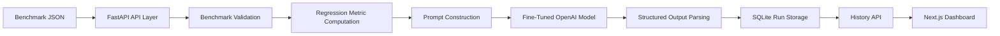

# Architecture

PerfCopilot is structured as a small, production-style full-stack system with a clear analysis path from benchmark ingestion to stored diagnosis.

## High-Level Flow

## Backend Layers

- `app/api`: HTTP routes and request orchestration
- `app/analysis`: prompt construction, model invocation, metric computation, output parsing
- `app/services`: run-history persistence workflow
- `app/db`: SQLAlchemy session + SQLite models
- `app/schemas`: request and response contracts
- `app/core`: configuration and auth dependencies

## Frontend Layers

- `frontend/src/app`: Next.js app entry
- `frontend/src/components`: dashboard UI
- `frontend/src/lib`: API-facing types and sample data

## Design Notes

- `/analyze` remains stateless for direct analysis calls.
- `/upload-benchmark` reuses the same analysis pipeline and adds persistence.
- SQLite is intentionally chosen to keep the local developer workflow simple and reproducible.
